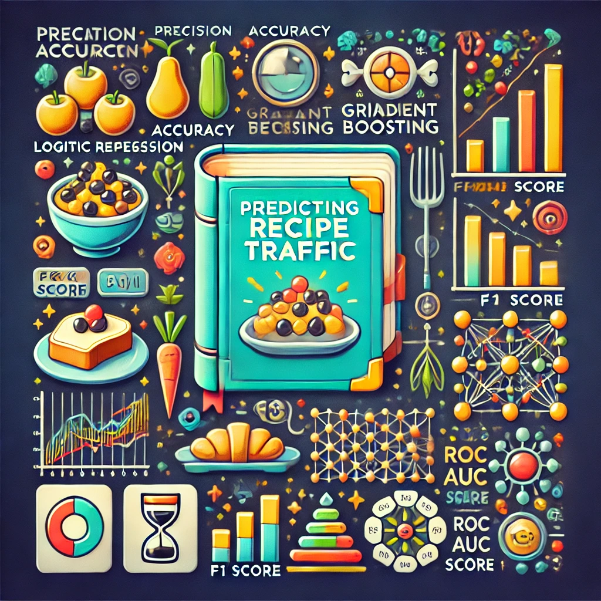
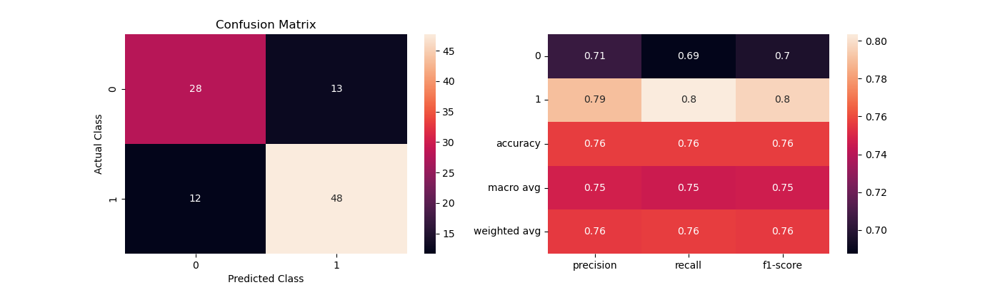
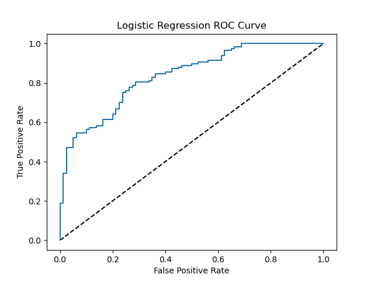
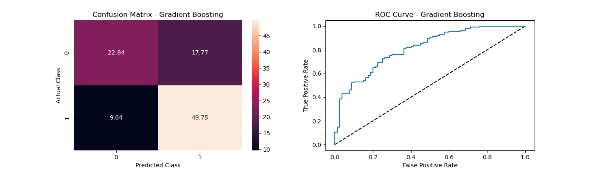

# Understanding Recipe Traffic Using Machine Learning Models

## Introduction
Why do some recipes gain massive user engagement while others remain overlooked? This blog explores how machine learning can predict recipe traffic using nutritional content and categorical features. By understanding key factors influencing user behavior, we aim to improve recipe recommendations and optimize user engagement.

---

## Project Objectives
The primary goals of this project are:
1. **Predict Recipe Traffic**: Classify recipes as "High Traffic" or "Low Traffic" based on key features.
2. **Feature Analysis**: Identify the most influential factors driving recipe popularity.
3. **Model Evaluation**: Compare machine learning models to determine the best-performing approach.

---

## Dataset
The dataset includes:
- **Nutritional Features**: Calories, protein, sugar, carbohydrates, etc.
- **Categorical Features**: Dish types (e.g., Breakfast, Dessert) and servings.

### **Data Preprocessing Steps**

1. **Handling Missing Values**:
   - Missing values in critical numerical columns (e.g., calories, protein, and sugar) were imputed using the mean or median, depending on the skewness of the data distribution.
   - Rows with excessive missing values across multiple columns were removed to maintain data integrity.
   - For categorical features, missing values were filled using the mode or a placeholder category, ensuring model compatibility.

2. **Standardization**:
   - Numerical features such as calories, protein, and sugar were standardized using Z-score normalization. This technique ensured all numerical inputs were on the same scale, which is critical for models like     
   Support Vector Machines (SVM) and K-Nearest Neighbors (KNN).

3. **One-Hot Encoding**:
   - Categorical features, including dish types (e.g., Breakfast, Dessert), were transformed into binary columns using one-hot encoding.
   - The one-hot encoding process expanded the feature space to ensure compatibility with machine learning algorithms that require numerical inputs.

4. **Feature Engineering**:
   - Interaction terms were created for key numerical features, such as combining protein and sugar, to capture nonlinear relationships.
   - Logarithmic transformations were applied to highly skewed numerical features (e.g., calorie counts) to normalize distributions and reduce the impact of outliers.

5. **Data Splitting**:
   - The dataset was split into training (70%), validation (15%), and testing (15%) subsets using stratified sampling to preserve the class distribution in each subset.
   - The validation set was used to tune hyperparameters, ensuring unbiased performance evaluation on the testing set.

6. **Class Imbalance Handling**:
   - To address class imbalance in the target variable, oversampling (using SMOTE) and undersampling techniques were tested.
   - A weighted loss function was implemented for certain models to penalize misclassification of the minority class more heavily.

---

## **Model Development**

### **Overview**
To predict recipe traffic, six machine learning models were trained and evaluated. Each model was optimized through hyperparameter tuning, ensuring the best possible performance on the validation set.

### **Models and Technical Details**

1. **Logistic Regression**:
   - **Purpose**: A linear model suitable for binary classification tasks with interpretable coefficients.
   - **Parameters**:
     - **Penalty**: `l2` (Ridge regularization) to prevent overfitting.
     - **C**: 1.0 (inverse regularization strength, tuned between `0.1` and `10`).
     - **Solver**: `liblinear` (suitable for small to medium-sized datasets).
   - **Optimization**:
     - Standardized all numerical features to ensure coefficients are on the same scale.

2. **Random Forest**:
   - **Purpose**: An ensemble learning method combining multiple decision trees to reduce variance and overfitting.
   - **Parameters**:
     - **Number of Trees**: `n_estimators = 100` (tuned in the range of `50–200`).
     - **Maximum Depth**: `max_depth = 10` (tuned to prevent overfitting).
     - **Minimum Samples Split**: `min_samples_split = 5` (minimum number of samples required to split an internal node).
     - **Criterion**: `gini` (default for impurity-based splits).
   - **Optimization**:
     - Performed grid search over key hyperparameters.
     - Feature importance scores were extracted post-training.

3. **K-Nearest Neighbors (KNN)**:
   - **Purpose**: A non-parametric method relying on proximity to predict class labels.
   - **Parameters**:
     - **Number of Neighbors**: `n_neighbors = 5` (tuned between `3–15`).
     - **Distance Metric**: `minkowski` with `p=2` (equivalent to Euclidean distance).
     - **Weights**: `uniform` (all neighbors have equal weight).
   - **Optimization**:
     - Applied feature scaling (standardization) to ensure equal contribution from all numerical features.
     - Validation performance declined with higher `k` due to loss of local structure.

4. **Support Vector Machine (SVM)**:
   - **Purpose**: A powerful linear classifier effective in high-dimensional spaces.
   - **Parameters**:
     - **Kernel**: `rbf` (Radial Basis Function) to capture nonlinear relationships.
     - **Regularization Parameter**: `C = 1.0` (tuned between `0.1–10`).
     - **Gamma**: `scale` (controls kernel influence, tuned between `0.001–1.0`).
   - **Optimization**:
     - Used grid search to fine-tune hyperparameters.
     - Balanced class weights to address class imbalance.

5. **Gradient Boosting**:
   - **Purpose**: An ensemble method that builds trees sequentially, correcting previous errors.
   - **Parameters**:
     - **Learning Rate**: `0.1` (tuned between `0.01–0.3`).
     - **Number of Estimators**: `n_estimators = 100` (optimized for validation performance).
     - **Maximum Depth**: `max_depth = 3` (controls complexity of individual trees).
     - **Subsample**: `0.8` (percentage of samples used for training each tree).
   - **Optimization**:
     - Early stopping based on validation loss to prevent overfitting.

6. **Neural Networks**:
   - **Purpose**: A multilayer perceptron (MLP) for capturing complex nonlinear relationships.
   - **Architecture**:
     - Input Layer: Matches the number of input features.
     - Hidden Layers: Two layers with `128` and `64` neurons, respectively.
     - Output Layer: Single neuron with sigmoid activation for binary classification.
   - **Parameters**:
     - **Activation Function**: `ReLU` for hidden layers.
     - **Optimizer**: `Adam` with learning rate `0.001`.
     - **Loss Function**: Binary cross-entropy.
     - **Batch Size**: 32.
     - **Epochs**: 50 (with early stopping based on validation accuracy).
   - **Optimization**:
     - Used dropout (`rate = 0.2`) to mitigate overfitting.
     - Applied batch normalization for faster convergence.

### **Model Training Workflow**
1. **Data Splitting**:
   - Training Set: 70%.
   - Validation Set: 15%.
   - Testing Set: 15%.

2. **Cross-Validation**:
   - Stratified 5-fold cross-validation was used to ensure balanced class distributions in all splits.

3. **Hyperparameter Tuning**:
   - Grid search and random search were employed to identify the best hyperparameters for each model.
   - Validation performance metrics (e.g., F1 Score and ROC AUC) guided parameter selection.

4. **Performance Evaluation**:
   - Each model was evaluated using the testing set to ensure unbiased performance estimates.

---

### **Performance Metrics**
To evaluate each model, the following metrics were used:
- **Precision**: Proportion of true positive predictions among all positive predictions.
- **Accuracy**: Overall correctness of predictions.
- **Recall**: Proportion of true positives identified among all actual positives.
- **F1 Score**: Weighted average of precision and recall.
- **ROC AUC Score**: Measures the ability of the model to distinguish between classes.

### **Visualization of Performance**
#### **Confusion Matrices**
The confusion matrix below demonstrates the classification performance of Logistic Regression and Gradient Boosting. These visualizations provide a breakdown of predictions for true positives, true negatives, false positives, and false negatives. The ROC curves evaluate the trade-off between sensitivity (True Positive Rate) and specificity (False Positive Rate) for the two best-performing models:

 
*Confusion matrix for Logistic Regression.*

  
*Receiver Operating Characteristic curve for Logistic Regression.*

*Confusion matrix for Gradient Boosting.*

---

### **Feature Importance**
Key insights from feature importance analysis reveal the features that significantly impact model predictions. Gradient Boosting provides a ranking of these features:

1. **Protein**: The most critical predictor, strongly associated with user interest.
2. **Vegetable**: Significant contribution to recipe popularity.
3. **Breakfast**: Consistently highlighted as a high-impact categorical feature.

---

## Conclusion

### **Key Takeaways**
- **Logistic Regression**: Best-performing model due to its balance of precision, recall, and simplicity.
- **Gradient Boosting**: Provided strong performance, particularly for minority class predictions.
- **Feature Importance**: Nutritional features (e.g., protein) and categorical features (e.g., Breakfast) are strong drivers of recipe traffic.

### **Business Impact**
- Insights from this analysis can help prioritize recipes with high traffic potential, optimize recipe recommendations, and increase overall user engagement.

### **Future Directions**
1. **Feature Engineering**: Incorporate additional data points like preparation time, ingredient costs, and user ratings.
2. **Advanced Models**: Experiment with ensemble methods (e.g., stacking) for enhanced predictive performance.
3. **Deployment**: Integrate the model into a real-time recommendation system for recipe platforms.

---

## Explore the Full Project
For detailed code, visualizations, and further insights, visit the [GitHub Repository](https://github.com/CoskunErden/Kaggle_recipe).

---
